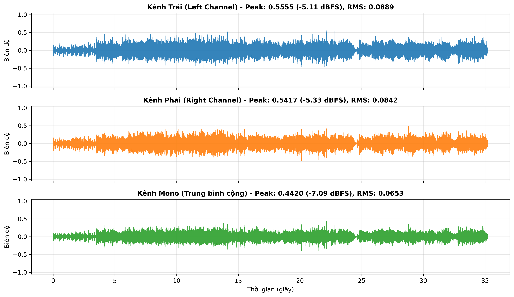

# BÁO CÁO THỰC HÀNH LAB 1: PHÂN TÍCH VÀ XỬ LÝ TÍN HIỆU ÂM THANH SỐ

* **Học phần:** CSE457 – Xử lý âm thanh và tiếng nói
* **Họ và tên sinh viên:** Nguyễn Văn Minh
* **Mã số sinh viên (MSSV):** 2351260673
* **Ngôn ngữ & Môi trường:** Python 3.12 (Anaconda & `.venv`), Jupyter Notebook
* **Tệp âm thanh thực nghiệm:** `piano_sample.mp3` (Trích đoạn độc tấu Piano Solo)

---

## KHỐI A: ĐỌC VÀ KIỂM TRA DỮ LIỆU ÂM THANH (AUDIO METADATA & NORMALIZATION)

### 1. Mục tiêu thực nghiệm
1. Đọc và giải mã dữ liệu âm thanh số từ tệp nguồn `audio/piano_sample.mp3`.
2. Trích xuất, kiểm tra các thông số kỹ thuật số hóa: Tần số lấy mẫu ($F_s$), số kênh ($C$), thời lượng ($T$), độ sâu mẫu ($B$), kích thước tệp và tốc độ bit ($Bitrate$).
3. Thực hiện chuyển đổi từ tín hiệu 2 kênh (Stereo) sang 1 kênh (Mono) theo phương pháp trung bình cộng $x_{\text{mono}}[n] = \frac{x_L[n] + x_R[n]}{2}$.
4. Chuẩn hóa miền biên độ từ dạng số nguyên có dấu 16-bit về miền số thực chuẩn $[-1.0, 1.0]$.
5. Đo lường các đại lượng miền thời gian ban đầu (Peak, RMS, Crest Factor) và đánh giá nguy cơ méo biên (Clipping).

---

### 2. Bảng thông số Metadata đo được từ tệp thực nghiệm

| Thuộc tính kỹ thuật | Giá trị đo được | Đơn vị / Diễn giải |
| :--- | :--- | :--- |
| **Tên tệp** | `piano_sample.mp3` | Tệp âm thanh nén định dạng MPEG Audio Layer III |
| **Tần số lấy mẫu ($F_s$)** | $48{,}000$ | $\text{Hz}$ ($48\text{ kHz}$) |
| **Tần số Nyquist ($F_s / 2$)** | $24{,}000$ | $\text{Hz}$ ($24\text{ kHz}$) |
| **Số kênh âm thanh ($C$)** | 2 | Stereo (Trái - Phải) |
| **Độ rộng mẫu giải mã ($B$)** | 16 | $\text{bit/mẫu}$ ($2\text{ bytes/mẫu}$) |
| **Thời lượng ($T$)** | $35.243$ | $\text{giây}$ ($1{,}691{,}664$ mẫu trên mỗi kênh) |
| **Kích thước tệp lưu trữ** | $854{,}823$ | $\text{bytes}$ ($\approx 0.82\text{ MB}$) |
| **Tốc độ bit tệp MP3 (Thực tế)** | $\approx 194.0$ | $\text{kbps}$ (Nén Lossy $\approx 192\text{ kbps}$) |
| **Tốc độ bit PCM 16-bit tương đương** | $1{,}536.0$ | $\text{kbps}$ ($R_{\text{PCM}} = 48{,}000 \times 16 \times 2$) |
| **Dung lượng PCM thô lý thuyết** | $\approx 6.45$ | $\text{MB}$ |

---

### 3. Bảng số liệu biên độ và năng lượng (Stereo vs. Mono)

Các đại lượng được tính theo công thức:
* **Giá trị đỉnh (Peak):** $\text{Peak} = \max_n |x[n]|$
* **Giá trị hiệu dụng (RMS):** $\text{RMS} = \sqrt{\frac{1}{N} \sum_{n=0}^{N-1} x^2[n]}$
* **Mức biên độ logarit:** $\text{Level (dBFS)} = 20 \log_{10}(\text{Value})$

| Kênh âm thanh | Peak (Biên độ tuyệt đối) | Peak (dBFS) | RMS (Hiệu dụng) | RMS (dBFS) | Crest Factor ($Peak/RMS$) |
| :--- | :---: | :---: | :---: | :---: | :---: |
| **Kênh Trái (Left)** | $0.5555$ | $-5.11\text{ dBFS}$ | $0.0889$ | $-21.02\text{ dBFS}$ | $6.25$ |
| **Kênh Phải (Right)** | $0.5417$ | $-5.33\text{ dBFS}$ | $0.0842$ | $-21.50\text{ dBFS}$ | $6.43$ |
| **Kênh Mono (Trung bình cộng)** | $0.4420$ | $-7.09\text{ dBFS}$ | $0.0653$ | $-23.70\text{ dBFS}$ | $6.77$ |

---

### 4. Đồ thị trực quan hóa dạng sóng (Waveform)

*Hình A.1: So sánh dạng sóng miền thời gian giữa kênh Trái, kênh Phải và kênh Mono (trung bình cộng) sau khi đã chuẩn hóa về khoảng $[-1.0, 1.0]$.*

---

### 5. Nhận xét và phân tích kỹ thuật

1. **Phân tích tần số lấy mẫu và định lý lấy mẫu Nyquist-Shannon:**
   * Tệp âm thanh sử dụng tần số lấy mẫu chuyên nghiệp $F_s = 48\text{ kHz}$. Theo định lý Nyquist-Shannon, điều kiện cần để tái lập hoàn toàn tín hiệu liên tục mà không sinh ra méo chồng phổ (aliasing) là:
     $$F_s \ge 2 F_{\max} \iff F_{\max} \le \frac{F_s}{2} = 24\text{ kHz}$$
   * Do tai người bình thường chỉ có khả năng cảm nhận âm thanh trong dải tần số từ $20\text{ Hz}$ đến $20\text{ kHz}$, tần số Nyquist $24\text{ kHz}$ đã tạo ra một khoảng chuyển tiếp bảo vệ (guard band) rộng $4\text{ kHz}$ ($20\text{ kHz} \rightarrow 24\text{ kHz}$), giúp bộ lọc chống chồng phổ (anti-aliasing filter) phần cứng khi thu âm hoạt động tối ưu.

2. **Phân tích trường âm học Stereo và phép gộp Mono:**
   * So sánh giữa hai kênh độc lập cho thấy: Kênh Trái có năng lượng cao hơn một chút so với kênh Phải ($RMS_{\text{Left}} = 0.0889$ vs. $RMS_{\text{Right}} = 0.0842$). Điều này thể hiện chân thực đặc tính vật lý của đàn piano acoustic trong phòng thu: micro bên trái đặt gần cụm dây trầm (bass strings) vốn có kích thước dây lớn và năng lượng cơ học rung động cao hơn cụm dây bổng (treble strings) ở micro bên phải.
   * Phép chuyển đổi sang Mono bằng trung bình cộng $x_{\text{mono}}[n] = \frac{x_L[n] + x_R[n]}{2}$ giúp hòa trộn đồng nhất hai luồng âm học mà không làm méo dạng sóng tổng thể. Giá trị đỉnh của kênh Mono giảm xuống $0.4420$ do hai kênh có độ lệch pha tức thời nhẹ (destructive phase interference ở một số thời điểm).

3. **Kiểm tra hiện tượng xén biên (Clipping Check):**
   * Sau khi chuẩn hóa về thang đo chuẩn $[-1.0, 1.0]$, giá trị biên độ đỉnh lớn nhất của kênh Mono chỉ đạt $0.4420$ (tương đương mức $-7.09\text{ dBFS}$).
   * Mức headroom an toàn đạt tới $7.09\text{ dBFS}$ so với ngưỡng cắt $0\text{ dBFS}$ ($1.0$). Điều này khẳng định tín hiệu hoàn toàn sạch, không có bất kỳ mẫu nào bị xén đỉnh (clipping), đảm bảo các thuật toán phân tích phổ FFT/STFT và bộ lọc số ở các phần tiếp theo không bị nhiễu hài giả mạo (spurious harmonics).
