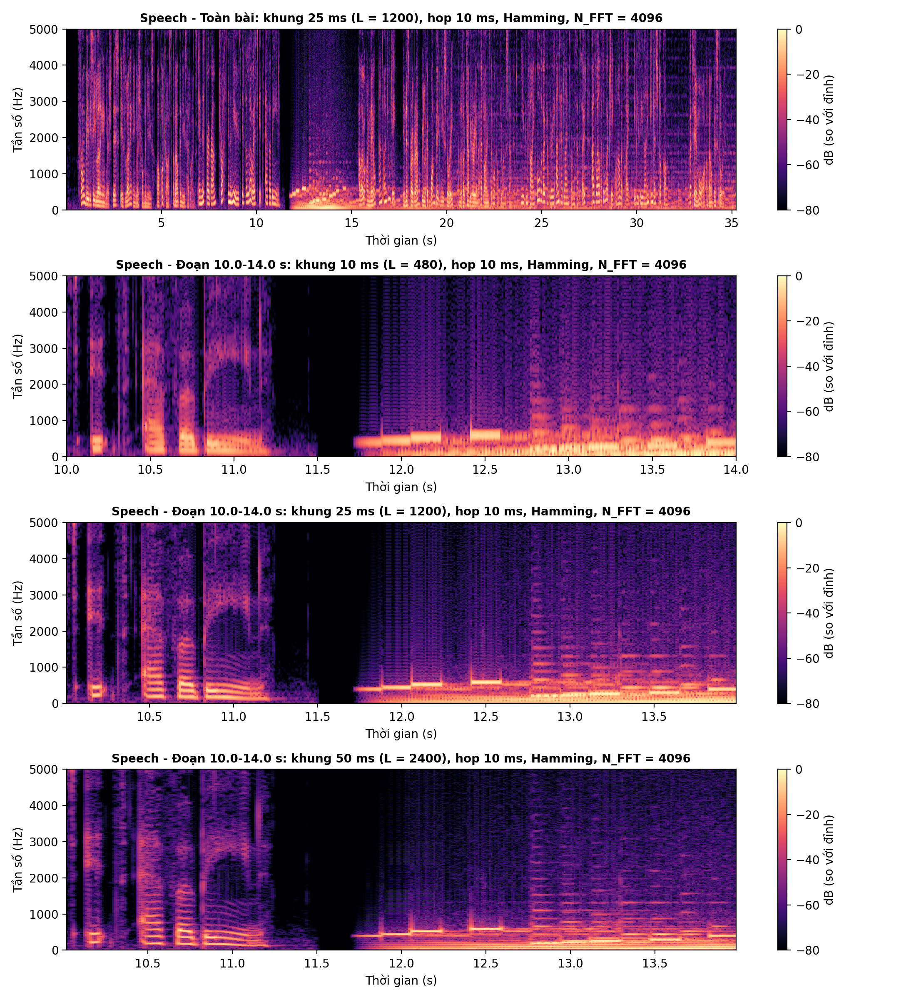
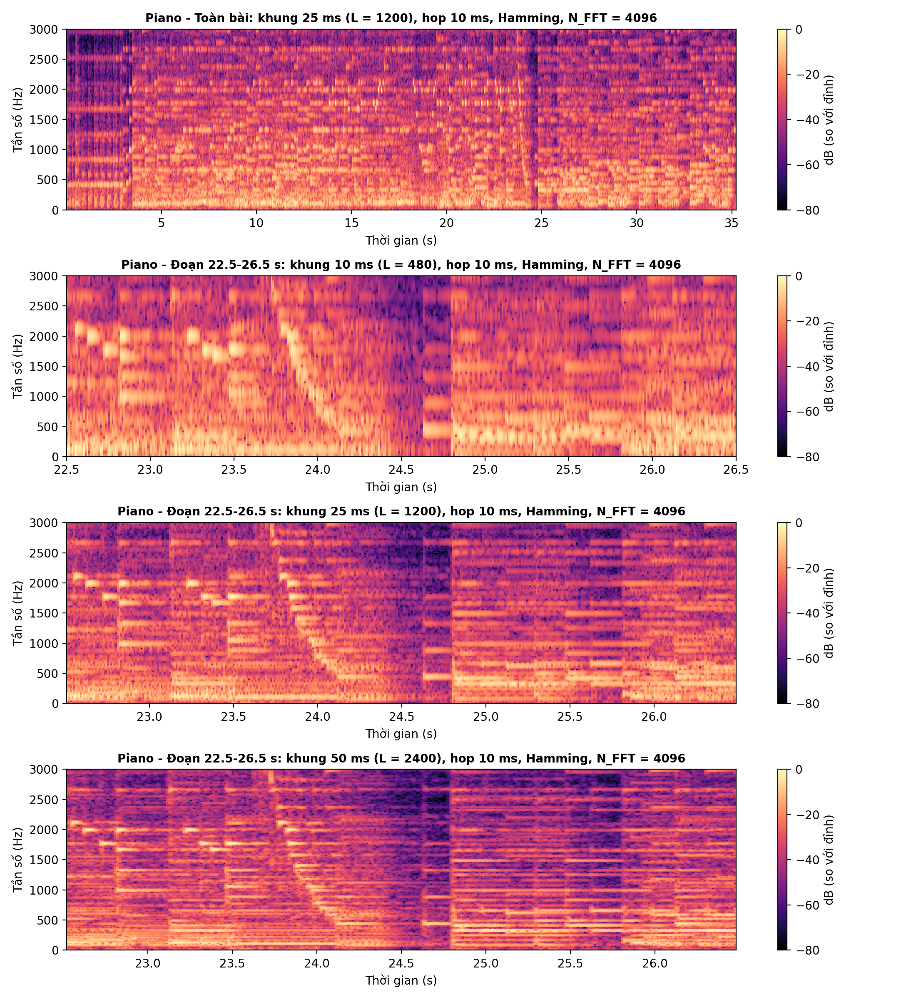
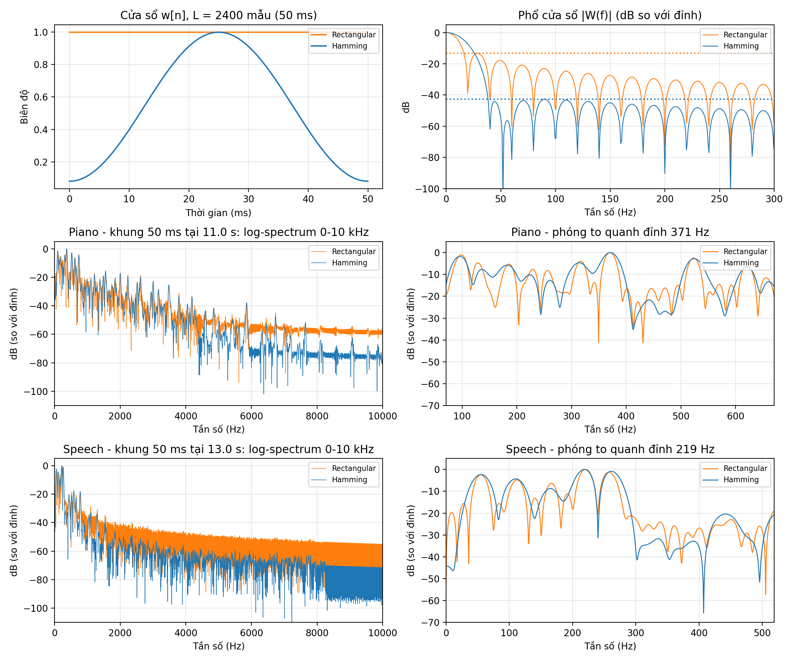
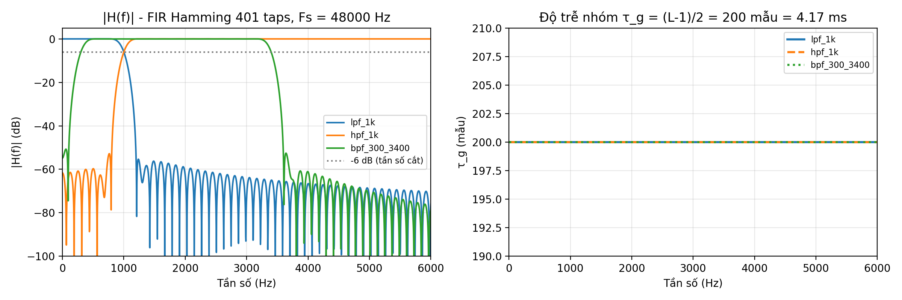
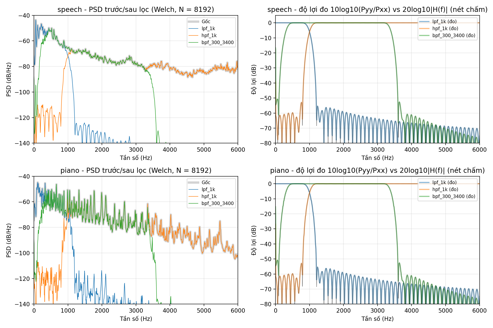
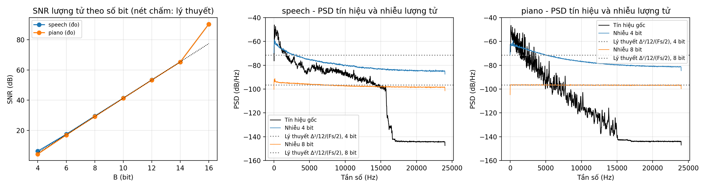
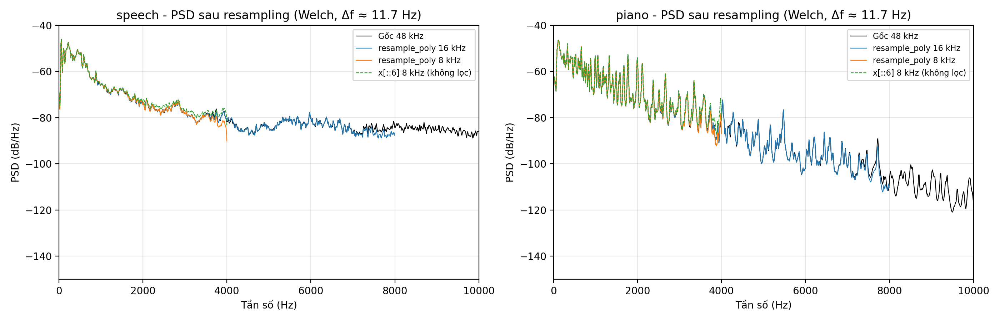

# BÁO CÁO LAB 1: PHÂN TÍCH VÀ XỬ LÝ TÍN HIỆU ÂM THANH SỐ

* **Học phần:** CSE457 – Xử lý âm thanh và tiếng nói
* **Sinh viên:** Nguyễn Văn Minh – MSSV 2351260673
* **Môi trường:** Python 3.12 (NumPy, SciPy, Matplotlib, Pandas, Pydub, SoundFile)
* **Dữ liệu:** `audio/input_piano.mp3` (âm nhạc), `audio/input_speech.mp3` (tiếng nói)

---

## KHỐI A: ĐỌC VÀ KIỂM TRA DỮ LIỆU

Đọc 2 file MP3, chuyển stereo sang mono, chuẩn hóa về $[-1, 1]$ (chia cho $2^{15}$).

| Tệp | $F_s$ | $C$ | $B$ | $T$ | Dung lượng | Bit rate MP3 | $R_{\text{PCM}} = F_s B C$ | Peak | RMS |
|:---|:---:|:---:|:---:|:---:|:---:|:---:|:---:|:---:|:---:|
| Piano | 48 kHz | 2 | 16 | 35.243 s | 834.8 KB | 194.0 kbps | 1536 kbps | 0.4420 (−7.09 dBFS) | 0.0653 (−23.70 dBFS) |
| Speech | 48 kHz | 2 | 16 | 35.243 s | 834.6 KB | 194.0 kbps | 1536 kbps | 0.4571 (−6.80 dBFS) | 0.0658 (−23.64 dBFS) |

| Stereo → mono | RMS L | RMS R | RMS mono | Tương quan $\rho_{LR}$ | mono $= (L+R)/2$ |
|:---|:---:|:---:|:---:|:---:|:---:|
| Piano | 0.0889 | 0.0842 | 0.0653 | 0.14 | Đúng (≤ 1 LSB) |
| Speech | 0.0680 | 0.0651 | 0.0658 | 0.95 | Đúng (≤ 1 LSB) |

**Nhận xét:**
1. $F_s = 48$ kHz cho Nyquist $F_s/2 = 24$ kHz, phủ hết dải nghe 20 Hz – 20 kHz.
2. Không bị clipping: Peak < 1 với headroom ≥ 6.8 dB.
3. **Mono:** $\text{RMS}_{mono}^2 = (\text{RMS}_L^2 + \text{RMS}_R^2 + 2\rho\,\text{RMS}_L\text{RMS}_R)/4$. Speech có 2 kênh gần giống nhau nên RMS gần như không đổi. Piano thu stereo rộng ($\rho = 0.14$) nên RMS giảm khoảng 2.5 dB khi trộn mono.
4. MP3 là định dạng nén lossy. Giải mã sang PCM 16 bit không khôi phục được phần thông tin đã mất.

---

## KHỐI B: PHÂN TÍCH MIỀN THỜI GIAN

$\text{Peak} = \max|x[n]|$, $\text{RMS} = \sqrt{\frac{1}{N}\sum x^2[n]}$, $E = \sum x^2[n] = N \cdot \text{RMS}^2$.

| Tệp | Đoạn (1 s) | Peak | RMS (dBFS) | $E$ |
|:---|:---|:---:|:---:|:---:|
| Speech | Toàn bài | 0.4571 | −23.64 | 7317.54 |
| Speech | 13–14 s (phát âm mạnh) | 0.4058 | −16.93 | 973.58 |
| Speech | 11–12 s (có khoảng lặng) | 0.1551 | −31.01 | 38.04 |
| Piano | Toàn bài | 0.4420 | −23.70 | 7216.60 |
| Piano | 11–12 s (hợp âm mạnh) | 0.3349 | −21.62 | 330.65 |
| Piano | 0–1 s (dạo nhẹ) | 0.1361 | −29.63 | 52.25 |

*Hình B.1–B.2: Hàng 1 là toàn bài, có tô màu 2 đoạn khảo sát; hàng 2–3 là 2 đoạn đó phóng to.*

**Nhận xét:**
1. **Speech:** Tỉ số $E_1/E_2 = 25.6$ lần (14.1 dB). Đoạn 13–14 s là nguyên âm hữu thanh, dao động tuần hoàn. Đoạn 11–12 s có khoảng lặng gần như tuyệt đối (11.50–11.71 s).
2. **Piano:** Chênh lệch nhỏ hơn: $E_1/E_2 = 6.3$ lần (8.0 dB), vì nhạc piano ngân liên tục, không có khoảng lặng.
3. Tiếng nói gián đoạn (có âm và lặng xen kẽ), còn piano liên tục và suy giảm dần theo thời gian.

---

## KHỐI C: PHÂN TÍCH TẦN SỐ BẰNG FFT

Đoạn 1 s ($L = 48000$) nhân cửa sổ Hamming, dùng `rfft`. Khoảng cách bin $\Delta f = F_s/N_{\text{FFT}}$, độ phân giải vật lý $\approx F_s/L$.

| Đỉnh | Piano 11–12 s | Nốt gần nhất | Speech 13–14 s |
|:---:|:---:|:---:|:---:|
| 1 | 86.43 Hz (51.8 dB) | F2 (87.31 Hz) | 54.93 Hz (65.2 dB) |
| 2 | 129.64 Hz (52.6 dB) | C3 (130.81 Hz) | 109.13 Hz (56.1 dB), $F_0$ |
| 3 | 174.32 Hz (48.2 dB) | F3 (174.61 Hz) | 165.53 Hz (51.5 dB) |
| 4 | 624.76 Hz (49.6 dB) | D#5 (622.25 Hz) | 260.74 Hz (53.1 dB) |
| 5 | 744.14 Hz (50.1 dB) | F#5 (739.99 Hz) | 292.97 Hz (53.9 dB), vùng $F_1$ |

| Cấu hình | $L$ | $N_{\text{FFT}}$ | $\Delta f$ bin | Độ phân giải vật lý $F_s/L$ |
|:---|:---:|:---:|:---:|:---:|
| Khung ngắn | 2048 | 2048 | 23.44 Hz | 23.44 Hz |
| Khung ngắn + zero-padding | 2048 | 65536 | 0.73 Hz | **23.44 Hz (không đổi)** |
| Đoạn 1 s | 48000 | 65536 | 0.73 Hz | 1.00 Hz |

*Hình C.1–C.2: Phổ tuyến tính, phổ dB có đánh dấu 5 đỉnh, và so sánh $N_{\text{FFT}}$ 2048 với 65536 trên dải 50–600 Hz.*

**Nhận xét:**
1. **Piano** có các đỉnh rời rạc trùng với nốt nhạc (sai lệch < 4.2 Hz). **Speech** tập trung dưới 500 Hz, $F_0 \approx 109$ Hz (giọng nam).
2. **Zero-padding** chỉ làm lưới tần số dày hơn (nội suy): các điểm của $N = 2048$ nằm đúng trên đường cong $N = 65536$. Độ phân giải thực chỉ tăng khi tăng $L$.

---

## KHỐI D: STFT VÀ SPECTROGRAM

$X[m,k] = \sum_n x[n]\,w[n-mH]\,e^{-j2\pi kn/N}$. Cố định: Hamming, hop 10 ms, $N_{\text{FFT}} = 4096$, thang màu $[-80, 0]$ dB. Chỉ thay đổi độ dài khung. Đoạn khảo sát: Speech 10–14 s, Piano 22.5–26.5 s.

**Kiểm chứng:** STFT tự viết khớp `scipy.signal.stft`; thỏa Parseval ($14.360626 = 14.360626$); số khung $M = 1 + \lfloor (N_x - L)/H \rfloor$ đúng ở cả 6 cấu hình.

| Khung | $L$ | $B_{3dB} \approx 1.30F_s/L$ | Số đỉnh < 1 kHz (Speech / Piano) | Số khung lặng (đo / lý thuyết) |
|:---:|:---:|:---:|:---:|:---:|
| 10 ms | 480 | 130 Hz | 0 / 1 | 20 / 20 |
| 25 ms | 1200 | 52 Hz | 2 / 3 | 18 / 18 |
| 50 ms | 2400 | 26 Hz | 8 / 8 | 16 / 16 |

*Hình D.1–D.2: Hàng 1 là toàn bài (khung 25 ms); hàng 2–4 là cùng một đoạn 4 s với khung 10 / 25 / 50 ms.*

**Nhận xét:**
1. **Khung dài thì phân giải tần số tốt hơn:** Khung 10 ms có $B_{3dB} = 130$ Hz, lớn hơn $F_0 = 109$ Hz nên các họa âm bị gộp lại (không đếm được đỉnh nào dưới 1 kHz). Khung 50 ms tách được 8 đỉnh.
2. **Khung ngắn thì phân giải thời gian tốt hơn:** Khoảng lặng 206.6 ms chỉ được "nhìn thấy" bởi các khung nằm trọn trong nó, nên số khung lặng giảm 20 → 16 khi khung dài ra. Khung dài làm nhòe biên sự kiện.
3. **Ổn định và transient:** Nốt ngân và nguyên âm tạo vạch ngang (vùng ổn định). Lúc bấm phím và lúc bắt đầu phát âm tạo vạch dọc dải rộng (transient). Khung 25 ms là mức cân bằng.

---

## KHỐI E: THÍ NGHIỆM CỬA SỔ

Dùng cùng một khung 50 ms ($L = 2400$), $N_{\text{FFT}} = 65536$. Piano lấy tại 11.0 s, Speech tại 13.0 s.

| Chỉ số | Rectangular (đo / lý thuyết) | Hamming (đo / lý thuyết) |
|:---|:---:|:---:|
| Main-lobe (null-to-null) | 39.6 / 40 Hz | 80.6 / 80 Hz |
| Side-lobe cao nhất | −13.3 / −13.3 dB | −42.7 / −42.7 dB |
| Độ rộng −3 dB của đỉnh thực (Piano / Speech) | 19.8 / 19.8 Hz | 29.3 / 24.2 Hz |
| Nền phổ 5–10 kHz (Piano / Speech) | −56.8 / −55.9 dB | −72.8 / −71.4 dB |

*Hình E.1: Cửa sổ $w[n]$, phổ $|W(f)|$, và log-spectrum của cùng một khung tín hiệu.*

**Nhận xét:**
1. Số đo khớp lý thuyết: main-lobe $2F_s/L$ và $4F_s/L$, side-lobe −13.3 và −42.7 dB.
2. **Rectangular:** main-lobe hẹp nên tách được các đỉnh sát nhau, nhưng side-lobe cao làm năng lượng rò ra khắp phổ: nền phổ cao hơn khoảng 16 dB.
3. **Hamming:** đổi main-lobe rộng gấp đôi lấy ít rò rỉ, nên thấy được cả các thành phần yếu. Hamming phù hợp hơn để phân tích âm thanh.

---

## KHỐI F: LỌC SỐ FIR

Thiết kế bằng `firwin`: cửa sổ Hamming, 401 taps, $F_s = 48$ kHz. Ba bộ lọc: LPF 1 kHz, HPF 1 kHz, BPF 300–3400 Hz. Lọc bằng `lfilter`, bù trễ $\tau_g$, rồi xuất `audio/filtered_{speech,piano}_*.wav`.

| Kiểm chứng | Kết quả |
|:---|:---|
| $b[n] = b[L-1-n]$ (pha tuyến tính) | Đúng cả 3 bộ lọc |
| $\tau_g = (L-1)/2$ | 200 mẫu = 4.17 ms |
| $\vert H\vert$ tại tần số cắt | −6.0 dB |
| Dải chắn LPF | ≤ −55.4 dB (lý thuyết Hamming ≈ −53 dB) |
| $h_{LP} + h_{HP} = \delta[n-200]$ | Sai lệch $1.4 \times 10^{-4}$; cộng 2 tín hiệu ra tái tạo $x$ với SNR 62 dB |
| $10\log(P_{yy}/P_{xx})$ so với $20\log\vert H\vert$ | Sai lệch trung vị < $4 \times 10^{-4}$ dB |

| Năng lượng giữ lại | LPF 1k | HPF 1k | BPF 300–3400 |
|:---|:---:|:---:|:---:|
| Speech | 95% | 4% | 41% |
| Piano | 79% | 18% | 52% |

*Hình F.1: $|H(f)|$ và độ trễ nhóm. Hình F.2: PSD trước/sau lọc; độ lợi đo được (nét liền) trùng $|H(f)|$ (nét chấm).*

**Nhận xét:**
1. Phổ sau lọc trùng với $|H(f)|$ trong dải thông, dải chuyển tiếp (≈ 395 Hz) và dải chắn. Lọc là phép nhân phổ: $Y = HX$.
2. Speech tập trung dưới 1 kHz nên HPF chỉ giữ 4% năng lượng. Piano có nhiều họa âm cao nên HPF giữ 18%.
3. Trễ 4.17 ms là rất nhỏ, dùng được cho xử lý real-time.

**Cảm nhận nghe** (khớp với phổ):

| File | Cảm nhận | Lý do theo phổ |
|:---|:---|:---|
| LPF 1 kHz | Đục, như nghe qua tường; mất tiếng "s", "x" | Mất dải trên 1 kHz |
| HPF 1 kHz | Mỏng, rè như loa điện thoại nhỏ; giọng mất độ trầm, piano mất bass | Mất $F_0$ và các họa âm thấp |
| BPF 300–3400 Hz | Giống giọng qua điện thoại, vẫn hiểu lời rõ | Giữ đúng băng thoại |

---

## KHỐI G: LƯỢNG TỬ HÓA, RESAMPLING VÀ MÃ HÓA

### 1. Lượng tử hóa

$\hat{x} = \text{round}(x q)/q$ với $q = 2^{B-1} - 1$, bước $\Delta = 1/q$. Đã kiểm tra $|e| \le \Delta/2$ ở mọi $B$. Xuất `audio/quantized_{speech,piano}_{4,8,16}bit.wav`.

| $B$ | SNR Speech | SNR Piano | Lý thuyết $6.02B + 4.77 + 20\log\sigma_x$ | $\sigma_e^2/(\Delta^2/12)$ |
|:---:|:---:|:---:|:---:|:---:|
| 4 | 6.25 dB | 4.35 dB | 5.2 dB | 0.60 / 0.92 |
| 8 | 29.48 dB | 29.17 dB | 29.3 dB | 0.94 / 1.00 |
| 12 | 53.40 dB | 53.32 dB | 53.3 dB | 0.99 / 1.00 |
| 16 | 90.31 dB | 90.31 dB | 77.4 dB | 0.05 / 0.05 |

**Nhận xét:**
1. Với 6–14 bit, SNR tăng 5.98 / 6.04 dB/bit, đúng quy luật 6.02 dB/bit. Nhiễu 8 bit là nhiễu trắng, đúng mức $\Delta^2/12$.
2. **4 bit lệch lý thuyết:** $\Delta = 0.143$ lớn hơn RMS 0.066 nên nhiều mẫu bị làm tròn về 0. Nhiễu bám theo tín hiệu, không còn là nhiễu đều.
3. **16 bit lệch lý thuyết:** Nguồn đã là PCM 16 bit nên lượng tử lại gần như không mất gì, SNR 90 dB > 77 dB.
4. **Cảm nhận nghe:** 16 bit không khác bản gốc. 8 bit có tiếng xì nền nhẹ, rõ nhất ở đoạn nhỏ hoặc lặng, vì nhiễu trắng lấn át ở nơi tín hiệu yếu. 4 bit rè và méo, các đoạn nhỏ bị mất hẳn do mẫu bị làm tròn về 0.

### 2. Resampling

Dùng `resample_poly` (có lọc chống chồng phổ). Xuất `audio/resampled_{speech,piano}_{16k,8k}.wav`.

| Tệp | $F_s$ mới | Số mẫu | Năng lượng giữ lại | Năng lượng gốc dưới $F_s/2$ mới |
|:---|:---:|:---:|:---:|:---:|
| Speech | 16 kHz | 563 883 | 0.9983 | 0.9976 |
| Speech | 8 kHz | 281 942 | 0.9943 | 0.9933 |
| Piano | 16 kHz | 563 883 | 1.0010 | 1.0000 |
| Piano | 8 kHz | 281 942 | 0.9997 | 0.9986 |

**Nhận xét:**
1. Số mẫu $= \lceil N F_{s2}/F_s \rceil$. Năng lượng giữ lại xấp xỉ năng lượng gốc dưới Nyquist mới (theo Parseval).
2. **Cảm nhận nghe:** Bản 16 kHz gần như không khác bản gốc (chỉ mất dải trên 8 kHz). Bản 8 kHz của Speech hơi bí, kém sáng, tiếng "s" bị nhòe, vì mất dải trên 4 kHz (0.67% năng lượng, chủ yếu là phụ âm xát). Piano ở 8 kHz gần như không đổi, vì năng lượng trên 4 kHz chỉ chiếm 0.14%.
3. Bỏ mẫu `x[::6]` mà không lọc gây **aliasing** −21.9 dB (Speech) và −30.0 dB (Piano), thấy rõ ở phổ vùng 3–4 kHz bị nâng lên.

### 3. Bit rate và compression ratio

| Định dạng | $R = F_s B C$ | Dung lượng (35.243 s) |
|:---|:---:|:---:|
| PCM stereo 48 kHz / 16 bit | 1536 kbps | 6.767 MB |
| PCM mono 16 kHz / 16 bit | 256 kbps | 1.128 MB |
| PCM mono 8 kHz / 16 bit | 128 kbps | 0.564 MB |
| MP3 (file gốc) | 194 kbps | 0.855 MB |

**Nhận xét:**
1. $\text{CR} = 6.767/0.855 = 7.92$, tiết kiệm 87.4% (so với PCM cùng $F_s$ và $C$).
2. Dung lượng WAV thực tế đúng bằng $N \cdot 2 \cdot C + 44$ byte cho cả 16 file đã xuất.
3. MP3 là nén lossy (phổ bị cắt ở ~15–16 kHz), nên không dùng làm ground truth.

---

## TRẢ LỜI CÂU HỎI BÁO CÁO

1. **Vì sao chỉ đến 22.05 kHz?** Ta có $\cos\!\left(2\pi (F_s - f) n/F_s\right) = \cos(2\pi n - 2\pi f n/F_s) = \cos(2\pi f n/F_s)$. Hai tần số $f$ và $F_s - f$ cho cùng một chuỗi mẫu, nên chỉ dải $[0, F_s/2] = [0, 22.05]$ kHz được biểu diễn duy nhất.
2. **$N_{\text{FFT}}$ 2048 → 8192, khung 25 ms:** Thay đổi: $\Delta f$ bin giảm từ 21.53 xuống 5.38 Hz. Không đổi: độ phân giải vật lý (≈ 52 Hz với Hamming) và độ phân giải thời gian, vì cả hai chỉ phụ thuộc $L$.
3. **Hamming và rò rỉ phổ:** Hamming làm hai đầu khung giảm dần nên side-lobe hạ từ −13.3 xuống −42.7 dB (ít rò rỉ). Đổi lại main-lobe rộng gấp đôi (40 → 80 Hz), nên hai đỉnh sát nhau dễ bị gộp.
4. **FIR 201 taps @ 44.1 kHz:** $\tau_g = 100/44100 = 2.27$ ms. Độ trễ này nhỏ so với ngưỡng cảm nhận khoảng 10 ms nên không đáng kể cho real-time, trừ khi nối nhiều tầng.
5. **Vai trò của $B$ và mức tín hiệu:** Mỗi bit thêm vào làm SNR tăng 6.02 dB. Vì $\Delta$ cố định theo $X_{\max}$, tín hiệu nhỏ hơn bao nhiêu dB thì SNR giảm bấy nhiêu dB. Ở bài này, $\sigma_x = 0.066$ làm mất 23.6 dB so với tín hiệu full-scale.
6. **WAV 60 s:** $44100 \times 16 \times 2 \times 60 / 8 = 10.58$ MB. MP3 128 kbps: 0.96 MB, nên CR ≈ 11.
7. **SNR thấp hơn nhưng nghe tốt hơn:**
   * (a) MP3/AAC đặt nhiễu dưới ngưỡng che (masking), nên tai không nhận ra.
   * (b) Dither biến nhiễu bám theo tín hiệu (như trường hợp 4 bit) thành nhiễu trắng êm hơn, dù tổng công suất nhiễu tăng.
   * (c) Tín hiệu chỉ bị trễ hoặc đổi pha (ví dụ không bù $\tau_g$) nghe y hệt bản gốc, nhưng SNR tính theo từng mẫu rất thấp.
