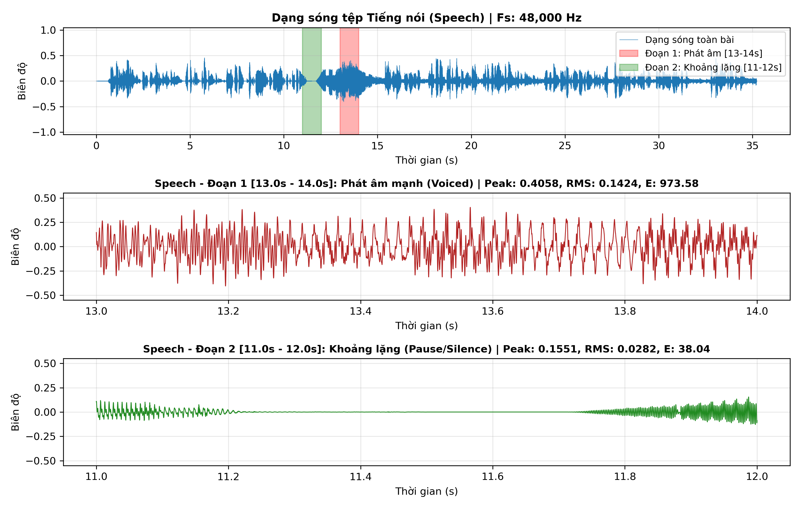
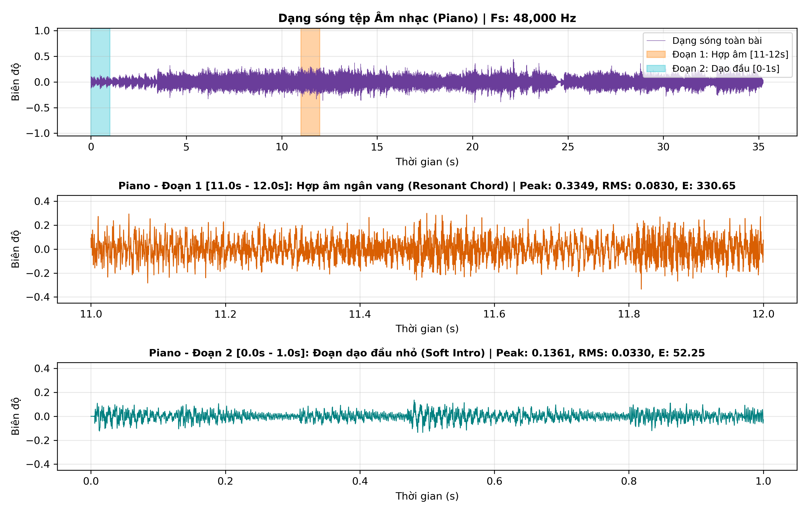
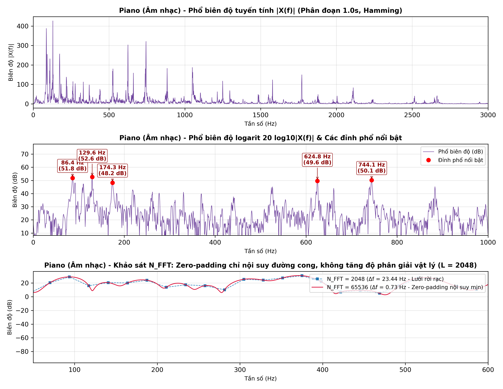
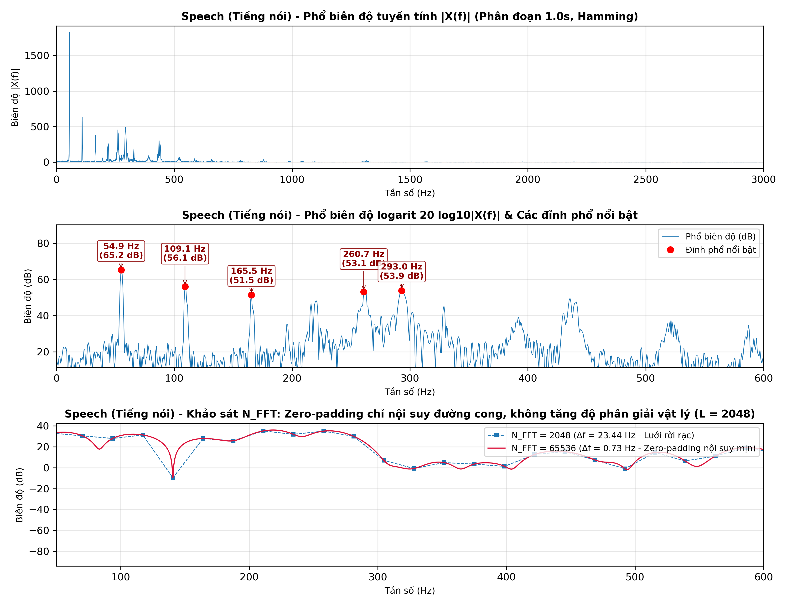

# BÁO CÁO LAB 1: PHÂN TÍCH VÀ XỬ LÝ TÍN HIỆU ÂM THANH SỐ

* **Học phần:** CSE457 – Xử lý âm thanh và tiếng nói
* **Sinh viên:** Nguyễn Văn Minh – MSSV 2351260673
* **Môi trường:** Python 3.12 (NumPy, SciPy, Matplotlib, Pandas, Pydub, SoundFile)
* **Dữ liệu:** `audio/piano_sample.mp3` (âm nhạc), `audio/news_speech.mp3` (tiếng nói)

---

## KHỐI A: ĐỌC VÀ KIỂM TRA DỮ LIỆU

Đọc 2 file MP3, chuyển stereo sang mono, chuẩn hóa về $[-1, 1]$ (chia cho $2^{15}$).

| Tệp | $F_s$ | $C$ | $B$ | $T$ | Dung lượng | Bit rate MP3 | $R_{\text{PCM}} = F_s B C$ | Peak | RMS |
|:---|:---:|:---:|:---:|:---:|:---:|:---:|:---:|:---:|:---:|
| Piano | 48 kHz | 2 | 16 | 35.243 s | 834.8 KB | 194.0 kbps | 1536 kbps | 0.4420 (−7.09 dBFS) | 0.0653 (−23.70 dBFS) |
| Speech | 48 kHz | 2 | 16 | 35.243 s | 834.6 KB | 194.0 kbps | 1536 kbps | 0.4571 (−6.80 dBFS) | 0.0658 (−23.64 dBFS) |

**Nhận xét:**
1. $F_s = 48$ kHz cho Nyquist $F_s/2 = 24$ kHz, phủ hết dải nghe 20 Hz – 20 kHz.
2. Không bị clipping: Peak < 1 với headroom ≥ 6.8 dB.
3. MP3 là định dạng nén lossy. Giải mã sang PCM 16 bit không khôi phục được phần thông tin đã mất.

---

## KHỐI B: PHÂN TÍCH MIỀN THỜI GIAN

$\text{Peak} = \max|x[n]|$, $\text{RMS} = \sqrt{\frac{1}{N}\sum x^2[n]}$, $E = \sum x^2[n] = N \cdot \text{RMS}^2$.

| Tệp | Đoạn (1 s) | Peak | RMS (dBFS) | $E$ |
|:---|:---|:---:|:---:|:---:|
| Speech | Toàn bài | 0.4571 | −23.64 | 7317.54 |
| Speech | 13–14 s (phát âm mạnh) | 0.4058 | −16.93 | 973.58 |
| Speech | 11–12 s (có khoảng lặng) | 0.1551 | −31.01 | 38.04 |
| Piano | Toàn bài | 0.4420 | −23.70 | 7216.60 |
| Piano | 11–12 s (hợp âm mạnh) | 0.3349 | −21.62 | 330.65 |
| Piano | 0–1 s (dạo nhẹ) | 0.1361 | −29.63 | 52.25 |

*Hình B.1–B.2: Hàng 1 là toàn bài, có tô màu 2 đoạn khảo sát; hàng 2–3 là 2 đoạn đó phóng to.*

**Nhận xét:**
1. **Speech:** Tỉ số $E_1/E_2 = 25.6$ lần (14.1 dB). Đoạn 13–14 s là nguyên âm hữu thanh, dao động tuần hoàn. Đoạn 11–12 s có khoảng lặng gần như tuyệt đối (11.50–11.71 s).
2. **Piano:** Chênh lệch nhỏ hơn: $E_1/E_2 = 6.3$ lần (8.0 dB), vì nhạc piano ngân liên tục, không có khoảng lặng.
3. Tiếng nói gián đoạn (có âm và lặng xen kẽ), còn piano liên tục và suy giảm dần theo thời gian.

---

## KHỐI C: PHÂN TÍCH TẦN SỐ BẰNG FFT

Đoạn 1 s ($L = 48000$) nhân cửa sổ Hamming, dùng `rfft`. Khoảng cách bin $\Delta f = F_s/N_{\text{FFT}}$, độ phân giải vật lý $\approx F_s/L$.

| Đỉnh | Piano 11–12 s | Nốt gần nhất | Speech 13–14 s |
|:---:|:---:|:---:|:---:|
| 1 | 86.43 Hz (51.8 dB) | F2 (87.31 Hz) | 54.93 Hz (65.2 dB) |
| 2 | 129.64 Hz (52.6 dB) | C3 (130.81 Hz) | 109.13 Hz (56.1 dB), $F_0$ |
| 3 | 174.32 Hz (48.2 dB) | F3 (174.61 Hz) | 165.53 Hz (51.5 dB) |
| 4 | 624.76 Hz (49.6 dB) | D#5 (622.25 Hz) | 260.74 Hz (53.1 dB) |
| 5 | 744.14 Hz (50.1 dB) | F#5 (739.99 Hz) | 292.97 Hz (53.9 dB), vùng $F_1$ |

| Cấu hình | $L$ | $N_{\text{FFT}}$ | $\Delta f$ bin | Độ phân giải vật lý $F_s/L$ |
|:---|:---:|:---:|:---:|:---:|
| Khung ngắn | 2048 | 2048 | 23.44 Hz | 23.44 Hz |
| Khung ngắn + zero-padding | 2048 | 65536 | 0.73 Hz | **23.44 Hz (không đổi)** |
| Đoạn 1 s | 48000 | 65536 | 0.73 Hz | 1.00 Hz |

*Hình C.1–C.2: Phổ tuyến tính, phổ dB có đánh dấu 5 đỉnh, và so sánh $N_{\text{FFT}}$ 2048 với 65536 trên dải 50–600 Hz.*

**Nhận xét:**
1. **Piano** có các đỉnh rời rạc trùng với nốt nhạc (sai lệch < 4.2 Hz). **Speech** tập trung dưới 500 Hz, $F_0 \approx 109$ Hz (giọng nam).
2. **Zero-padding** chỉ làm lưới tần số dày hơn (nội suy): các điểm của $N = 2048$ nằm đúng trên đường cong $N = 65536$. Độ phân giải thực chỉ tăng khi tăng $L$.

